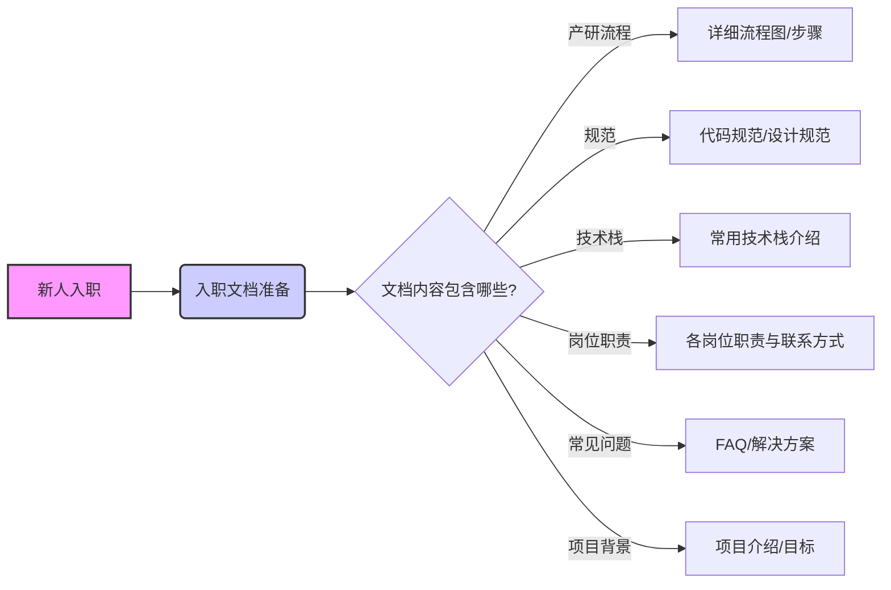
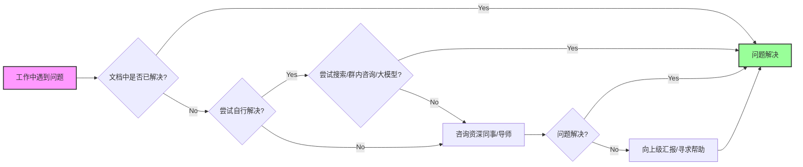

以下内容其实是工作三个月的问题总结和反思，感觉也可以公开发出来。

## 【问题 1】技术债  

发现了有的模块存在的问题，但是因为时间紧张或者别的原因没有在当下进行优化。最后躲过的【技术债】总是会在未来的某个时间又出现在面前，造成返工。  

原因：  

1. 时间紧张。有的时候是模块的历史设计存在问题，但是在当下急着上线。想着快迭出能满足需求的版本，于是只能在现有的基础上改造。过了发现问题的时机，又有了其他的需求排期，导致这个优化项被延后。直到积累到一个必须要改造的程度。
2. 在意流程正确，比如与他人有依赖项，总想着要说出来进需求池里，然后排期。

解决：  
提升对关键问题的敏感度。如果发现某问题会导致系统结构恶化或未来开发复杂度显著增加，尝试在当前阶段即使没有全部解决，也优先处理核心风险点或留下可扩展的接口。  

【老的模块】
设置技术债记录机制，对于每次开发中意识到但未能立即解决的问题，建立一个“技术债清单”，明确记录问题描述、影响范围、预计成本与优先级。定期回顾，并在每轮迭代中预留时间专门用于偿还技术债。  
回顾哪些模块返工率高、哪些历史设计拖慢了进度，记录并反思当初没处理的点是如何演变成问题的。  

【新的模块】设定一定比例的技术预研时间，主动了解依赖方或调用方的业务

## 【问题 2】业务理解的问题  

有的时候是在做一个需求的执行者，把【需求转化为代码】，但是没有去理解这个需求的上下文，解决了什么问题，可能会造成什么样的影响。  

现阶段或许看不出来问题，但是如果时间久了自身的竞争力会下降。  

无论是传统的开发还是大模型的出现之后，开发其实都在进行【需求转化为代码】的工作，虽然大模型的出现以及 long context 的不断扩展，让输入需求 --- 编写代码这种形式变得越来越简单。

与此同时，大模型的也是有局限性的，它可以去写单测，但是目前无法完成集成测试
其次大模型上下文即使可以很长，但是依然无法将业务上下文全部灌输于它。

所以对于产出结果的质量和正确与否的评估会越来越重要。  

所以依然需要开发对于需求有正确的理解，这样在未来才拥有竞争力，而不是简单的做一个“翻译者”。

原因：  

1. **缺乏上下游信息**：仅接触到单个的需求文档，不了解整个大项目的背景讨论。
2. 客户服务意识欠缺：习惯站在开发视角思考问题，关注点在“功能有没有开发完”，而不是“是否真正解决了对方的问题”。缺少从使用者角度去审视体验、流程和痛点

## 【问题 3】做事方式没有及时转变  

之前的工作内容更多的是纯开发，在刚开始阶段并未及时调整做事方式，出现了以下问题：

- 新人常常遇到重复性问题
- 后续需要进行多次口头答疑或返工
- 有些非核心问题占用了不必要的沟通时间
感悟是：把前期培训做好或者工作流传达好会省去后期的二次培训和返工成本。  

比如应该在前期写好面向新人的入职文档，包括项目背景、产研流程、规范、常用技术栈，遇到问题应该找什么岗位的人等等的指引，以及需要培养善用搜索、群内咨询和大模型的意识，这样前期很常见的问题可以在入职文档中找到解决方案，并且不会说一出现问题就来寻求他人的帮助。  

对于新人的入职文档准备总结如下：

对于问题解决的意识如下：

<!-- issues-blog:source=d1:post.reflections-about-work -->
<!-- issues-blog:published-at=2025-07-31T23:43:00.000Z -->

